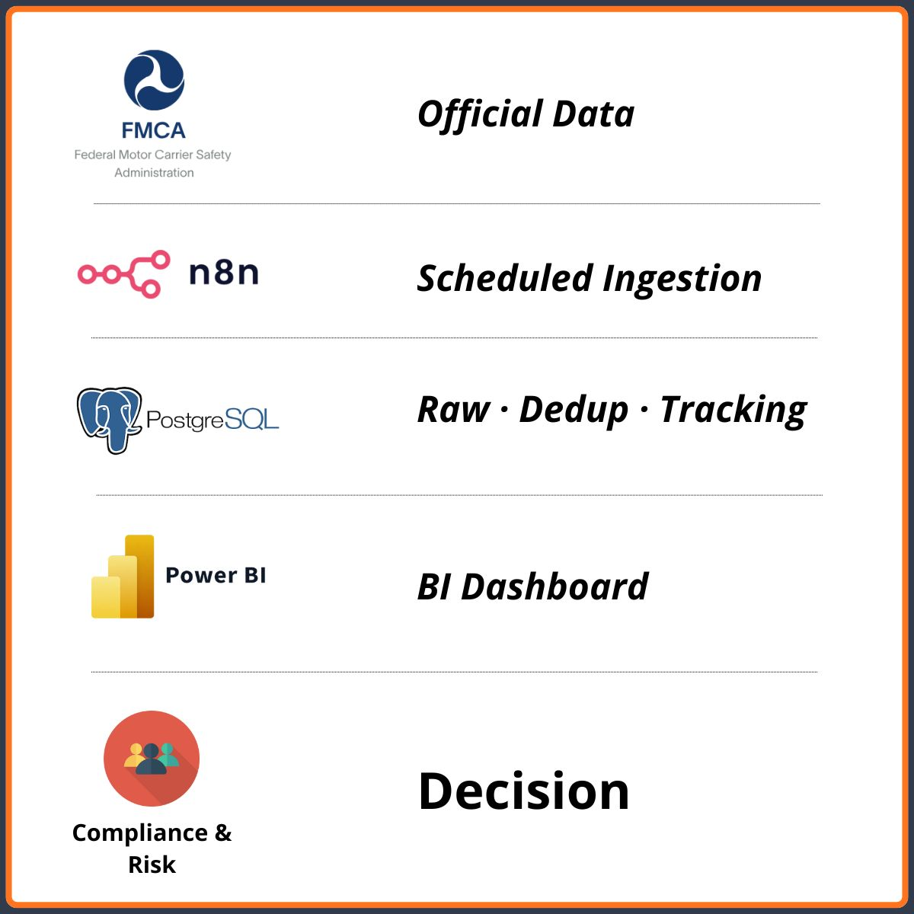

# FMCSA Revocation Monitoring Automation

This project demonstrates an automated compliance monitoring pipeline built to track carrier authority revocations using official FMCSA data.

## Overview
The system replaces manual checks on the FMCSA portal with scheduled data ingestion, structured storage, deduplication, and BI reporting.

## Architecture
- FMCSA API (official government data source)
- Automation layer for scheduled ingestion
- PostgreSQL for raw storage, deduplication, and historical tracking
- BI layer for analysis across 30/60/90-day windows
- 

## What’s automated
- Periodic data collection from the FMCSA API
- Deduplication and historical tracking of revocation records
- Data delivery to a BI layer for compliance analysis

## Tech stack
n8n · REST APIs · PostgreSQL · Power BI
